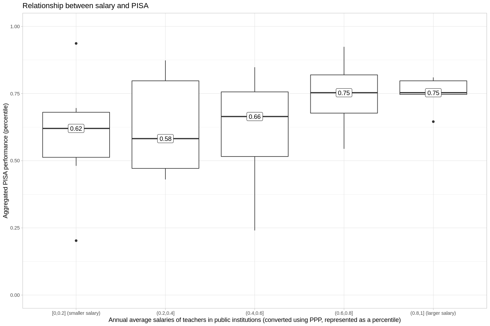
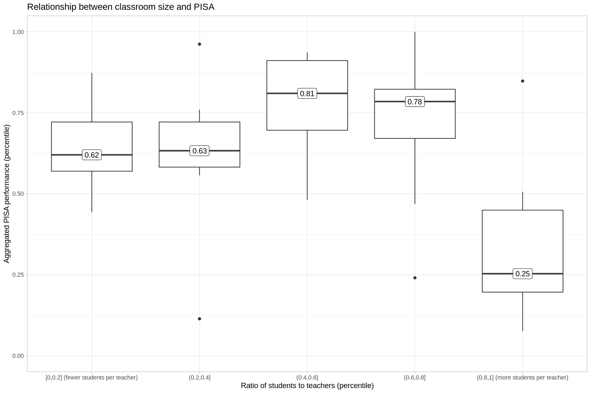

# Teachers' jobs, and students' outcomes

TL;DR: Students score better on an academic assessment where...
- Teachers are paid more
- There are 12 students for every 1 teacher

# Introduction

Do the working conditions that we public school teachers face end up impacting their students in quantifiable ways?
Ideally, we'd conduct a randomized manipulation, helping out some teachers, and stressing other teachers out; but this would be:
- unethical
- expensive

Instead, we can look at organic data, and look for correlations between teachers' conditions and students' educational outcomes.
We'll use the following metrics, derived from data collected by the Organisation for Economic Cooperation and Development ([OECD](https://en.wikipedia.org/wiki/OECD)).

Teaching conditions:
- Salary
- Ratio of students to teachers
- How much time teachers spend working

An academic assessment:
- The Programme for International Student Assessment (PISA), a tool that measures 15 year-olds' skills in reading, math, and science

And in the attached R notebook, you can find a structural equation model that explores whether adults' qualities of life may correlate to the quality of their educations.
But to be frank, I expect that if you're interested in that kind of analysis, you'd rather see the original code, anyway-- so I won't include that here.

# The metrics
## Salary
- "Annual average salaries (including bonuses and allowances) of teachers in public institutions, in equivalent USD converted using PPPs for private consumption" ([OECD](https://www.oecd-ilibrary.org/education/data/education-database/educational-expenditure-by-educational-level_c1267206-en))
- As a result of the PPP conversion, we can compare incomes in one country to incomes in another, without worrying about things like currency exchange rates.

- Impressions:
  - The average income for teachers in the USA is not as low as we might guess.
  - Eastern Europe and Latin America offer the smallest salaries.

- Teacher salaries in Germany are much higher than in other countries.
- Germanic countries (Austria, Netherlands, etc.), by-and-large, offer higher salaries.
- Countries that were recently subjugated by foreign powers seem to offer lower incomes.

## Ratio of students to teachers
- "This dataset shows the ratio of full-time students to full-time teaching staff" ([OECD](https://www.oecd-ilibrary.org/education/data/education-at-a-glance/student-teacher-ratio-and-average-class-size_334a3b64-en))
- We'll look at the ratios at public schools, only.

- There's a bias towards smaller ratios in Europe, but it's not a hard-and-fast-rule.

- The four or five countries with the largest ratios have much larger ratios than Chile, the country with the sixth-largest ratio.
- Conversely, Iceland has a much smaller ratio than the next country, Luxembourg.

## Time working
- "This dataset presents internationally comparable data on teaching and working time of (full-time) teachers in public institutions at pre-primary, primary and general (lower and upper) secondary education. Data refer to formal statutory requirements and also cover actual teaching time" ([OECD](https://www.oecd-ilibrary.org/education/data/education-at-a-glance/teachers-teaching-and-working-time_d3ca76db-en))

- The Spearman's correlation coefficient between countries where teachers work more and earn more is 0.3, which isn't so bad.
It means that a lot of teachers who are working harder are getting paid more in turn.

- The teachers who work the most (those in Chile and Switzerland) work a lot more than teachers in the next few nations.
- Teachers in French Belgium work fewer than 1,000 hours per year-- nearly half as much as do their peers in Chile.

## PISA scores
- "PISA is the OECD's Programme for International Student Assessment.
PISA measures 15-year-olds' ability to use their reading, mathematics and science knowledge and skills to meet real-life challenges." ([OECD](https://www.oecd.org/PISA/))
- The correlations between these three subjects are pretty high (Spearman's correlation coefficients range from 0.99 to 1).
This collinearity means that we can aggregate, and simply look at each country's median PISA score.
- The [OECD](https://www.oecd.org/pisa/pisafaq/) indicates that the PISA has been validated against real-life social outcomes:
  >* "Four countries – Australia, Canada, Denmark and Switzerland – have conducted longitudinal studies that followed the cohort of students who sat the first PISA assessments in the early 2000s through their transition into adulthood. Across all of these countries, students who performed better in PISA at age 15 were more likely to attain higher levels of education by the age of 25. They were also less likely to be out of the labour market entirely, as measured by the percentage of students who were not in education, employment or training (NEET).*
  >* Of course, there is a link between the socio-economic status of a student’s household – including material living conditions and parents’ educational attainment – and the student’s performance in PISA. However, even after accounting for these factors, students who perform better in PISA at age 15 have stronger education and employment outcomes at the age of 25. In addition, what students say about themselves in the PISA questionnaires also appears related to young people’s future life prospects."

- Overall, wealthier countries seem to have higher scores than poorer countries.

- While wealthier countries seem to have higher scores overall, it's not a monotonic relationship:
  - Estonia has the sixth-highest PISA scores, but Estonia is not the sixth-wealthiest region in the world.
  - On the other hand, Saudi Arabia is in the first quantile of PISA performance, and has the 26th-largest GDP (PPP) per capita in the world.

# Correlations between teaching and PISA
## Salary  

- There's a clear positive relationship between salary and PISA.
- ...but there's also a lot more variance in the first three quantiles than there is in the last two, which is something the next plot will better explain.

- The Spearman's correlation coefficient is 0.4, which is pretty high.
- Interpretation:
  - There's a lot of variance in the countries that pay their teachers less than about 50,000 USD (PPP).
  If we were to subset our data to countries that pay less than about 50,000 USD, I'd wager that our healthy positive correlation would essentially vanish.
  - From the 50,000 USD (PPP) tick and above, we see another trend-- the countries reliably get marks around 500 on the PISA.
  These aren't the highest marks possible, but they're reliably high.

## Ratio of students to teachers

- The first two quantiles of students/teachers are in the ~60th percentile on the PISA.
- The third and fourth quantiles do better on the PISA, at about the 80th percentile.
- At the fifth quantile, students do much worse on the PISA.
- Roughly-speaking, this suggests that there's a gentle positive correlation between the ratio and PISA until about the third quantile, and from the fourth to the fifth quantiles there's a sharp negative correlation.

- Strictly-speaking, there's not a correlation between the ratio of students to teachers, and PISA outcomes (correlations don't allow for the changes in slope that we see before; they are a steady line).
And strictly-speaking, we decided from the outset to look for correlations.
  - But this doesn't mean there isn't a relationship.
  - I wanted to test the possibility that there's a non-linear relationship between the ratio and PISA scores, but it's intellectually dishonest to retroactively fit a story onto data.
  As a result, I tested four models using leave one out cross-validation.
  LOO CV is a pretty conservative strategy, so I think it helps to ensure that we're not just applying stories retroactively. I tested four models: cubic polynomial, squared polynomial, linear, and intercept-only.
  The best-performing model was, in fact, the squared model; there is a peak at 12 students, with a positive correlation before, and a negative one after.

## Time working

- It's tempting to say that there's another nonlinear relationship here that peaks at the third quantile, but there's a _lot_ of variance in the third quantile.

- Here we see the issue-- if we were to look at the data from countries where teachers work 1.2k hours per year to those where teachers work 1.4k hours per year, we see a positive correlation.
- On the other side of the distribution, we see a decline from about 1.7k to 2k hours.
- But in the middle, we see a lot of noise. Teachers in Estonia and Colombia work about the same amount of time per year, but their students have really different testing outcomes.
- I also tested a few models here using leave one out cross validation, but the best-fitting model was the intercept model, which means that there's essentially no overall relationship between PISA and how many hours a teacher works.

## Social outcomes
- People interested in latent variable analyses and structural equation models can check out what I think is the most plausible model of this data at the end of the [attached notebook](https://github.com/abartnof/worldwide_ed/blob/main/education.ipynb). Notes:
  -  I look at four social phenomena, and treat them as possible dependent variables of the educational system:
    - Mean number of hours worked per week in the main job among employed adults
    - Percentage of adults who read books at least once a week
    - Percentage of adults who reported that over the last 12 months it has been difficult for them to fulfill their family responsibilities because of the amount of time they spend at work
    - Percentage of employed adults who report having a high or very high flexibility of working hours in their main job
- While we have the statistical power here for things like correlations, we don't really have enough data to do a good job with SEM. As a result, this model is really best characterized as one possible description of the data. It's a description of the data that I find plausible, and in the future, I'd love to test it with more statistical power-- but for now, it's probably over-fit, and I haven't really subjected it to any goodness-of-fit tests.
