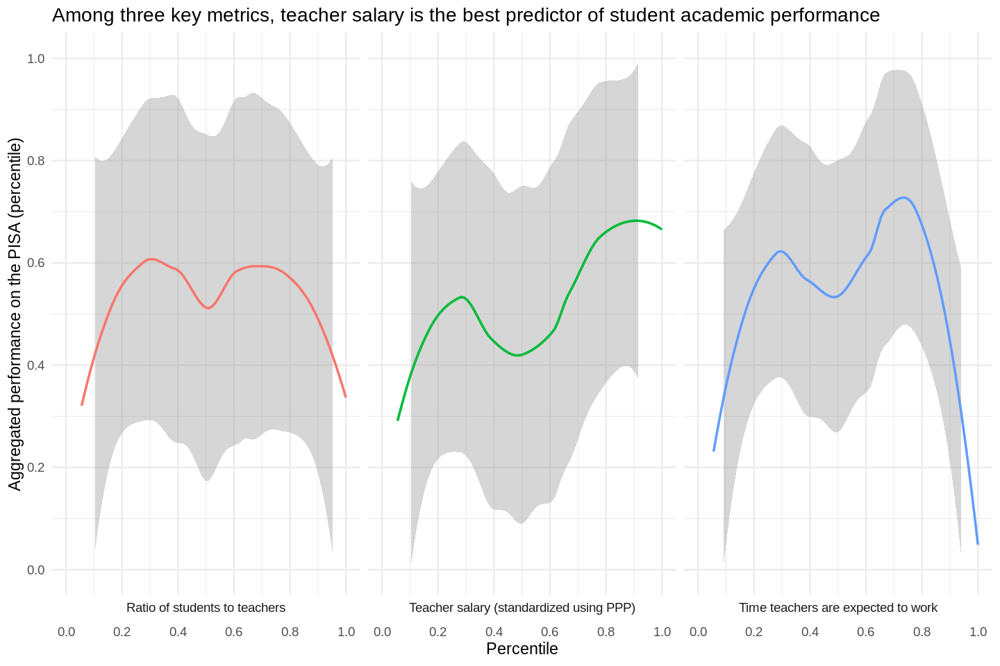

# The relationship between what we ask of teachers, and students' academic performance

The overly glib TL;DR - countries where teachers are paid more have students who learn more

# Introduction

If we make teachers\' jobs a little less stressful, what kinds of educational outcomes can we expect?
Ideally, we'd conduct a randomized manipulation, paying some teachers more, and others less-- but since this kind of manipulation might be unethical (citation needed), we can look at organic examples.

We'll use data collected by the Organisation for Economic Co-operation and Development([OECD](https://en.wikipedia.org/wiki/OECD)), to see if we can find any overwhelming trends out there.

We'll focus on three metrics that describe teaching:
- Salary (adjusted for PPP)
- The ratio of students to teachers
- How much time teachers spend annually on the clock

One academic outcome:
- The Programme for International Student Assessment (PISA), a tool that measures 15 year-olds' skills in reading, math, and science

And finally, four social outcomes:
- How flexible a person's work schedule is
- How often a person reads a book
- How often a person is precluded from spending time with their family, because they have to work
- How many hours per week a typical employed person has to work in their primary job
I'll save these four variables for a stats-heavy(er) structural equation model feat. latent variables, because their relationship with the educational system is probably a little looser than, say, PISA scores.

I'm going to be careful about my phrasing here-- I'd _like_ to say that if we do X, we get Y-- but this is hard to say without an experimental situation.
Instead, I'll describe correlations, with the knowledge that the correlations they describe might be causal, after all.

# Our metrics
## Salary
- "Annual average salaries (including bonuses and allowances) of teachers in public institutions, in equivalent USD converted using PPPs for private consumption" [OECD](https://www.oecd-ilibrary.org/education/data/education-database/educational-expenditure-by-educational-level_c1267206-en)
- The PPP bit is key-- it means that the salaries are comparable, because they are descriptive of _local_ purchasing power.

- If we glance at this map of the world, we see that:
  - Eastern Europe and Latin America offer the smallest salaries
  - Australia and Germany are the most salient well-paying countries
  - The average income for teachers in the USA is not as low as we might guess, taken in the global context; it's in the fourth quantile.

- In this diagram, we can see the incomes in PPP-adjusted USD, not just in terms of their percentiles.
- We can see that Germany offers a vastly higher average salary than other countries-- so high, we might call it an outlier.
- Germanic countries, by-and-large, offer higher salaries
- It also looks like countries that have been colonies of larger empires more recently offer smaller salaries, relative to local PPP

## Ratio of students to teachers
